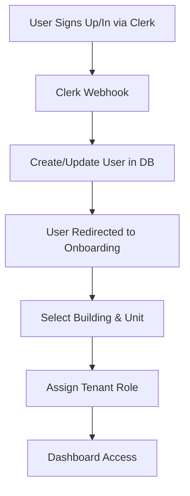

# Clerk Integration Plan

## Overview

Our Clerk integration needs to handle authentication while syncing with our database's role-based access control system. The key challenge is maintaining user profiles in our database while using Clerk for authentication.

## Integration Strategy

### 1. Authentication Flow



### 2. User Sync Strategy

We'll use Clerk webhooks to keep our database in sync:

1. **user.created** - Create User record with clerkId
2. **user.updated** - Update email, name, phone
3. **user.deleted** - Soft delete or anonymize

### 3. Role Management

Clerk will handle authentication, but our database manages roles:

```typescript
// Database roles (Building-scoped)
enum Role {
  TENANT
  ASSOCIATION_ADMIN  
  BUILDING_ADMIN
}

// Clerk public metadata structure
{
  "buildings": {
    "building_123": {
      "role": "TENANT",
      "unitId": "unit_456"
    }
  }
}
```

### 4. Middleware Strategy

```typescript
// Three levels of protection:
1. authMiddleware() - Requires Clerk authentication
2. requireRole() - Checks database role for building
3. requireUnit() - Ensures user has unit access
```

## Implementation Plan

### Phase 1: Basic Setup
1. Configure Clerk in app
2. Set up ClerkProvider
3. Create sign-in/sign-up pages
4. Configure redirects

### Phase 2: Database Sync
1. Set up webhook endpoint
2. Create user sync functions
3. Handle user lifecycle events
4. Store building/unit assignments

### Phase 3: Onboarding Flow
1. Check if user has unit assignment
2. Building selection page
3. Unit assignment request
4. Admin approval workflow

### Phase 4: Role-Based Access
1. Create auth utilities
2. Implement middleware
3. Add role checks to API routes
4. Update UI based on roles

### Phase 5: Multi-Building Support
1. Building switcher component
2. Cross-building role management
3. Scoped data access

## Key Components Needed

### 1. Webhook Handler
`/app/api/webhooks/clerk/route.ts`
- Validates webhook signatures
- Syncs user data
- Handles user lifecycle

### 2. Auth Utilities
`/lib/auth.ts`
- getCurrentUser() - Gets user with roles
- requireAuth() - Ensures authenticated
- requireRole() - Checks specific role
- getUserBuildings() - Gets all user buildings

### 3. Onboarding Pages
`/app/onboarding/*`
- Building selection
- Unit request
- Waiting for approval
- Success redirect

### 4. Admin Tools
`/app/dashboard/admin/*`
- Approve tenant requests
- Assign units
- Manage roles
- View pending requests

## Security Considerations

1. **Webhook Security**
   - Validate Clerk signatures
   - Use webhook secrets
   - Idempotent operations

2. **Role Verification**
   - Always check database roles
   - Don't trust client-side data
   - Scope all queries by building

3. **Data Privacy**
   - Respect user privacy settings
   - Filter data based on roles
   - Audit sensitive operations

## Edge Cases

1. **User switches buildings**
   - Maintain separate roles per building
   - Clear cached permissions
   - Update UI context

2. **User leaves building**
   - End tenancy record
   - Revoke building access
   - Preserve historical data

3. **Admin removes user**
   - Notify user
   - Grace period
   - Clean data migration

## Monitoring

1. Track webhook failures
2. Monitor sync delays
3. Alert on permission errors
4. Audit role changes